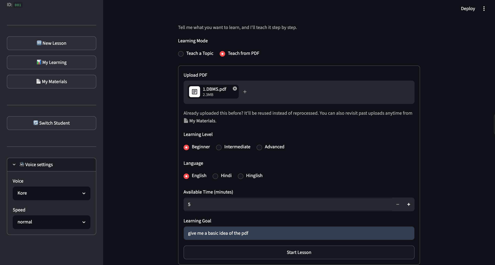
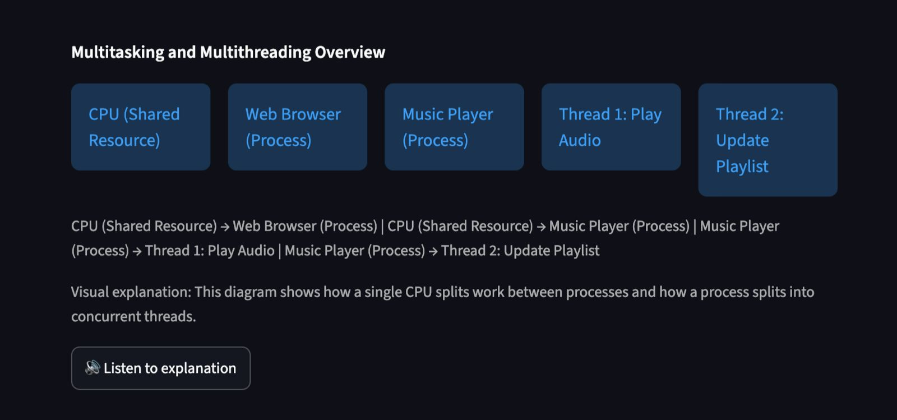
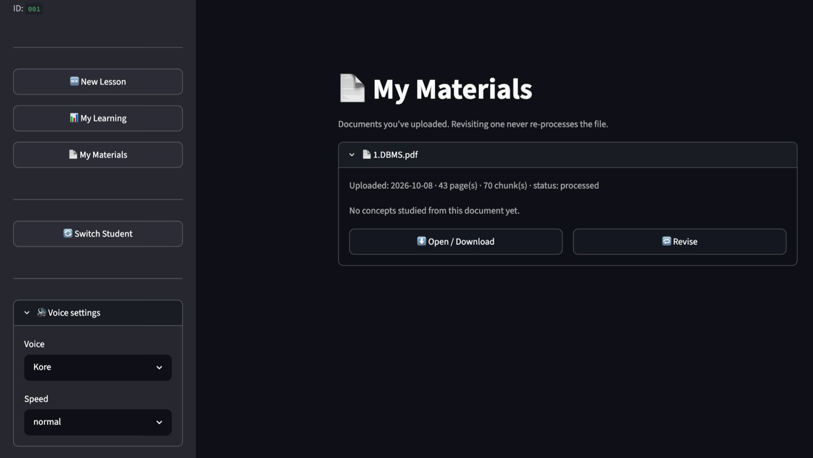

# AI Teacher

**An adaptive AI tutor that remembers what each student knows, finds what they struggle with, and builds revision lessons around it. Works from a topic or from your own PDFs, with visuals and spoken explanations in English, Hindi and Hinglish.**

Built with Python, Streamlit, Gemini, FAISS and SQLite.

## Screenshots




---

## Why this is different from a typical AI tutor

Most "AI tutor" projects are a chat box wrapped around an LLM. They forget the student the moment the session ends, and whatever "memory" they have lives inside the prompt.

AI Teacher is built around one rule: **the database remembers, the LLM teaches.**

- Scores, attempts, mastery and misconceptions are stored as facts in SQLite.
- Whether a concept is *weak*, *developing* or *strong* is decided by fixed rules in code, not by asking the model.
- Gemini only turns that already-decided state into teaching content: an explanation, an example, a question.

This makes the system predictable, debuggable and cheap to run, and it means personalization doesn't drift from one session to the next.

---

## Highlights

**Remembers every student**
- Per-concept mastery, tracked as a running average across all attempts, so one lucky answer can't erase a history of struggling.
- Misconceptions are saved when detected and marked resolved once the student shows real understanding.
- Multiple student profiles, each with fully separate history and documents.

**Revision that isn't just "repeat the lesson"**
- Click **Revise** on any studied topic or uploaded PDF.
- A plain Python function orders concepts by priority: weak concepts and unresolved misconceptions first, developing concepts next, strong concepts get one brief review.
- Each concept is re-taught from a different angle with a fresh example and a new question.

**Learns from your own material (RAG)**
- Upload a PDF; it is chunked, embedded and indexed with FAISS **once**.
- The index is saved per student, so revising later makes **zero** re-embedding calls.
- Lessons are grounded in retrieved passages, with page references shown in the UI.

**Safe, subject-aware visuals**
- The model decides *what* would help (equation, graph, table, code, diagram, or nothing).
- Python validates the data and draws it with fixed renderers. **Model output is never executed.**
- A graph with too few real data points is rejected instead of padded with invented numbers.

**Natural spoken explanations**
- Explanations are rewritten into a conversational teaching script before text-to-speech, so citations and markdown are never read aloud.
- English, Hindi and Hinglish, with a choice of voice and speed.
- Audio is cached on text + language + voice + speed, so the same explanation is never generated twice.

**Built to fail gracefully**
- If voice, visuals or retrieval fail, the written lesson and the question still work.
- Transient API errors (rate limits, overload) are retried automatically with backoff.

---

## How it works

```
Student  ->  Student memory (SQLite)
         ->  Topic or PDF  ->  RAG (FAISS) when a document is used
         ->  Lesson planner
         ->  Teaching step (explanation + question, one Gemini call)
         ->  Visual decision  ->  Visual renderer
         ->  Speech script    ->  TTS  ->  Cached audio
         ->  Student answers  ->  Evaluation (score + misconception)
         ->  Adapt (re-teach differently) or continue
         ->  Update student memory
```

### Design decisions worth knowing

| Decision | Why |
|---|---|
| LLM never stores state | Mastery and misconceptions are facts; storing them in a prompt makes them unreliable. |
| Status and revision order are deterministic | Weak is 0-49, developing 50-79, strong 80-100. Easy to test and explain. |
| Explanation and question share one Gemini call | Cut per-concept calls from two to one, lowering latency and cost. |
| LLM returns data, never code | Visuals are drawn by fixed Python renderers, so there is nothing for a model to execute. |
| Processed PDFs are persisted | Chunks and the FAISS index are serialized and reloaded, so revision costs no embedding calls. |
| Documents are scoped by student | Every query filters by `student_id`; guessing another student's document ID returns nothing. |
| Speech is its own layer | Raw explanations are never sent to TTS; a script step removes citations and makes it sound spoken. |

---

## Project structure

```
AI-Teacher/
├── app.py                    # Streamlit UI and session flow
├── teacher.py                # Lesson planning, teaching, evaluation (Gemini)
├── rag/
│   ├── pdf_processor.py      # PDF -> page-aware chunks
│   ├── embeddings.py         # Gemini embeddings
│   └── vector_store.py       # FAISS index, save/load, retrieval
├── database/
│   ├── student_db.py         # Students, sessions, mastery, misconceptions, revision plan
│   └── document_library.py   # Persisted PDFs, chunks and indexes (per student)
├── visuals/
│   ├── visual_selector.py    # LLM decides which visual; Python validates it
│   └── visual_renderer.py    # Fixed, safe renderers
├── voice/
│   ├── script_generator.py   # Explanation -> natural spoken script
│   ├── tts.py                # Gemini text-to-speech
│   └── audio_manager.py      # Audio cache
├── requirements.txt
└── .env.example
```

---

## Getting started

**Requirements:** Python 3.10+ and a free [Gemini API key](https://aistudio.google.com/apikey).

```bash
git clone <your-repo-url>
cd AI-Teacher

python -m venv venv
source venv/bin/activate        # Windows: venv\Scripts\activate
pip install -r requirements.txt

cp .env.example .env            # then paste your key into .env
streamlit run app.py
```

`.env` is git-ignored. Never commit your key.

| Variable | Required | Purpose |
|---|---|---|
| `GEMINI_API_KEY` | Yes | Used for teaching, embeddings and speech |
| `GEMINI_MODEL` | No | Override the default text model |
| `TTS_MODEL` | No | Override the text-to-speech model |
| `TTS_VOICE` | No | Override the default voice |

Model names change over time. If you get a "model not found" error, set the variables above to a currently available model.

---

## Try it

1. Enter a Student ID (for example `student_001`).
2. **New Lesson** -> topic -> pick level, language and goal.
3. Read the explanation and visual, click **Listen**, answer the question.
4. Answer one concept badly on purpose and finish the lesson.
5. Open **My Learning**. The weak concept shows up with its misconception.
6. Click **Revise** and see that concept prioritized, with a different explanation.
7. Switch to `student_002` and confirm there is no shared history or documents.
8. Try **Teach from PDF**, then revisit it later from **My Materials**.

---

## Limitations

This is a prototype, and I would rather say so than oversell it.

- **Not evaluated with real learners.** I haven't measured whether it improves learning outcomes.
- **No automated test suite yet.** Behaviour was checked with ad-hoc scripts that aren't in the repo.
- **No real authentication.** A Student ID is just a key, not a login.
- **Single machine.** SQLite and local files; not set up for concurrent users or deployment.
- **Concept matching across sessions is simple.** It uses case-insensitive substring matching, so a concept reworded by the model may not link to its history.
- **Misconception detection depends on the model.** It isn't validated against a curriculum.
- **Image visuals are placeholders.** Equations, graphs, tables, code and simple diagrams work; no image generation is wired up.
- **Text-to-speech is a preview model.** It can occasionally fail, in which case the app falls back to the written lesson.
- **Scanned PDFs are rejected.** There is no OCR.
- **Audio cache has no expiry.**

---

## Roadmap

- Automated tests for the memory, revision and caching logic
- Authentication and a proper database for multi-user use
- Semantic matching of concepts across sessions
- Image generation for visuals where a picture genuinely helps
- Deployment behind an API with a separate front end